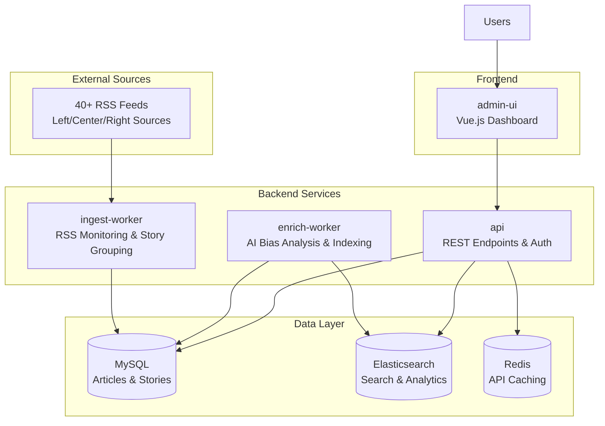

# OpenBias
OpenBias is a comprehensive news bias analysis platform inspired by Ground News. It intelligently aggregates articles from 40+ diverse news sources, performs AI-powered bias analysis, and presents multi-perspective coverage through a modern web interface. The system helps users discover news blindspots and understand media coverage patterns across the political spectrum.

## Key Features
- **AI-Powered Bias Analysis**: Multiple AI provider support for automated bias detection and sentiment analysis
- **Multi-Perspective Coverage**: Track left/center/right source distribution with visual bias indicators
- **Blindspot Detection**: Automated alerts for missing political perspectives in your news consumption
- **Advanced Story Grouping**: Multi-algorithm similarity matching using TF-IDF, Levenshtein distance, and semantic analysis using embeddings and consine similarity
- **40+ News Sources**: Continuous ingestion from diverse outlets across the political spectrum
- **User Authentication**: Personalized experiences with JWT-based security
- **Modern UI**: Responsive Vue.js interface with real-time updates and CoreUI components
- **Real-time Processing**: Optimized pipeline with configurable development limits

## Architecture
OpenBias follows a microservices architecture with separate workers for ingestion, analysis, and presentation:


### Core Components
- **`ingest-worker`**: Monitors 40+ RSS feeds, performs intelligent story grouping with quality controls, and maintains source diversity
- **`enrich-worker`**: AI-powered bias analysis using multiple providers, sentiment detection, and Elasticsearch indexing
- **`api`**: Hono-based REST API with JWT authentication, story endpoints, and user management with Redis caching for performance optimization
- **`admin-ui`**: Vue 3 + TypeScript dashboard with CoreUI components, bias visualization, and user authentication and real-time story feeds with an admin dashboard
- **`db`**: MySQL for persistent storage, Elasticsearch for advanced search and analytics, Redis for API response caching

## 🛠️ Management Commands
```bash
# Database Management
bun db:setup          # Complete setup: start services, migrate, seed, ingest, and analyze
bun db:update          # Fetch new articles and run bias analysis
bun db:update-force    # Clean old articles, fetch new ones, and run analysis
bun db:delete          # Stop services and delete all data

# Development utilities
bun --filter '*' run dev             # Run all services in development mode
bun --filter '*' run build           # Build all packages
```

## Quick Start

### Prerequisites
- [Bun](https://bun.sh/) - Fast JavaScript runtime and package manager
- [Docker](https://www.docker.com/) and [Docker Compose](https://docs.docker.com/compose/) - For MySQL, Elasticsearch, and Redis

### 1. Setup

```bash
# Clone repository
git clone https://github.com/yuvibirdi/open-bias
cd open-bias

# Install dependencies
bun install

# Copy environment file and configure
cp .env.example .env

```

### 2. Initialize Database

```bash
# Complete database setup with sources and sample data
bun db:setup
```

### 3. Development Workflow

```bash
# Run all services (recommended for development)
bun --filter '*' run dev

# Or run individual services:
bun --filter ./packages/api run dev          # Backend API
bun --filter ./packages/admin-ui run dev     # Frontend UI
bun --filter ./packages/ingest-worker run dev # RSS ingestion
bun --filter ./packages/enrich-worker run dev # AI analysis
```

### 4. Development Configuration

For faster development, edit processing limits in `packages/enrich-worker/src/index.ts`:

```typescript
const DEV_ARTICLE_LIMIT: number = 20;     // Articles to process (20 = quick testing)
const DEV_GROUP_ANALYSIS_LIMIT: number = 5; // Groups to analyze (5 = quick testing)
```
 Use `-1` for both values in production to process all content.

<!--
## Redis Caching System

OpenBias implements intelligent Redis caching to optimize API performance and reduce database load:

### Caching Strategy
- **Multi-layer Caching**: API responses, story searches, and analytics data are cached with configurable TTL
- **Smart Cache Keys**: Hierarchical key structure for efficient invalidation and pattern matching
- **Graceful Degradation**: System continues to operate normally when Redis is unavailable
- **Cache Hit Optimization**: Frequently accessed data like trending stories and search results are prioritized

### Cached Data Types
- **Story Feeds**: Trending stories, search results, and story details with 5-30 minute TTL
- **Analytics Data**: Bias distribution, coverage statistics, and overview metrics with 1-hour TTL  
- **Source Information**: News source metadata and bias classifications with long-term caching
- **Search Results**: Elasticsearch queries and article listings with medium-term TTL

### Cache Configuration
```typescript
// Cache TTL Settings
SHORT: 60s        // Frequently changing data
MEDIUM: 300s      // Moderately changing data  
LONG: 1800s       // Slowly changing data
VERY_LONG: 3600s  // Rarely changing data
```

### Performance Benefits
- **Response Time**: 80-95% faster API responses for cached data
- **Database Load**: Significant reduction in MySQL and Elasticsearch queries
- **Scalability**: Improved concurrent user handling and system throughput
- **Development**: Optional caching allows for easy debugging and testing

## AI-Powered Bias Analysis

OpenBias uses advanced algorithms to detect bias patterns and ensure comprehensive coverage:

### Story Grouping Algorithm
- **Multi-technique Similarity**: TF-IDF, Levenshtein distance, and semantic analysis
- **Quality Controls**: 0.7 combined similarity threshold with source diversity enforcement
- **Time-bound Grouping**: 24-hour window for article clustering
- **Size Limits**: Maximum 15 articles per group to prevent mega-groups

### Bias Detection Features
- **Multiple AI Providers**: OpenAI, Google Gemini, and Anthropic Claude support
- **Coverage Tracking**: Left/center/right source distribution monitoring
- **Blindspot Detection**: Automated alerts for missing perspectives
- **Sentiment Analysis**: Emotional tone and sensationalism scoring

## News Sources (40+ Outlets)

OpenBias monitors a carefully curated selection of news sources across the political spectrum:

### Source Distribution
- **Center/Neutral (16)**: Associated Press, Reuters, BBC, Wall Street Journal, USA Today, CBS, ABC, NBC, Financial Times, Bloomberg, Christian Science Monitor, Al Jazeera, Times (UK), Deutsche Welle, France 24
- **Left-leaning (14)**: New York Times, Washington Post, CNN, NPR, The Guardian, The Atlantic, New Yorker, Huffington Post, MSNBC, Vox, Mother Jones, The Nation, Slate, The Independent  
- **Right-leaning (13)**: Fox News, New York Post, Washington Examiner, The Federalist, National Review, The American Conservative, Breitbart, Washington Times, Daily Wire, Telegraph

### Quality Controls
- Automated bias classification with validation
- Feed availability monitoring and health checks
- Content quality filtering and duplicate detection
- Source diversity enforcement in story grouping

## Current Status & Roadmap

### Completed Features
- Multi-source story aggregation with quality controls
- AI-powered bias analysis and sentiment detection  
- Real-time coverage tracking and blindspot detection
- User authentication with JWT security
- Modern responsive Vue.js interface
- Advanced search and filtering capabilities
- Optimized pipeline with configurable development limits

### Future Enhancements
- Real-time WebSocket updates for live story feeds
- Enhanced ML models beyond OpenAI for bias detection
- Social features: user comments and discussions
- Email notifications for critical blindspots
- Mobile app development
- Advanced analytics dashboard
- International news source expansion

-->
## Contributing

Contributions are welcome.

## License

MIT 

