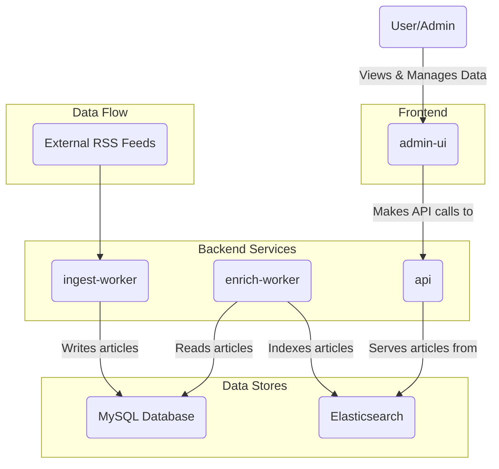

# OpenBias

OpenBias is a full-stack application designed to ingest news articles from various sources, analyze them for potential bias, and present them through a clean, searchable interface. The system features an enhanced story grouping algorithm that intelligently clusters related articles from different sources while maintaining strict quality controls to ensure meaningful story aggregation.

## Key Features

- **Enhanced Story Grouping**: Advanced multi-algorithm similarity matching using TF-IDF, Levenshtein distance, and word overlap analysis
- **Automated News Ingestion**: Continuous monitoring and fetching from 40+ diverse news sources across the political spectrum
- **Bias Analysis**: Comprehensive bias detection and coverage tracking for balanced perspective analysis
- **Quality Assurance**: Strict filtering with source diversity requirements, group size limits, and automated cleanup
- **Real-time Management**: Complete CLI-based system management with health monitoring and status reporting

## Architecture

The system is composed of several microservices and data stores that handle different aspects of the data pipeline, from ingestion to presentation.



- **`ingest-worker`**: Enhanced news ingestion service that fetches articles from 40+ RSS feeds using advanced similarity algorithms and quality controls. Features automated scheduling, source diversity enforcement, and intelligent story grouping.
- **`enrich-worker`**: Takes new articles from the database, performs AI-powered bias analysis, and indexes them into Elasticsearch for powerful searching and aggregation.
- **`api`**: A Hono-based API server that provides comprehensive endpoints for querying articles, story groups, and coverage analysis from Elasticsearch and MySQL.
- **`admin-ui`**: A Vue-based single-page application with CoreUI components for administrators to view stories, analyze bias coverage, and manage the ingestion system.
- **Data Stores**:
    - **MySQL**: The primary database for storing source information, articles, story groups, and coverage tracking.
    - **Elasticsearch**: Used for indexing enriched articles to provide fast and complex search capabilities.

## Packages

The monorepo is organized into the following packages:

-   `packages/admin-ui`: The frontend dashboard built with Vue 3, Vite, TypeScript, CoreUI, and Vue Router for story management and bias analysis.
-   `packages/api`: The main backend API that serves story data, trending articles, and bias coverage metrics to the UI.
-   `packages/db`: Contains the Drizzle ORM schema with enhanced story grouping tables, database connection logic, and comprehensive seeding scripts for 40+ news sources.
-   `packages/ingest-worker`: A sophisticated ingestion service with automated scheduling, advanced story matching algorithms, and quality assurance mechanisms.
-   `packages/enrich-worker`: A processing service that performs bias analysis, story enrichment, and Elasticsearch indexing with enhanced metadata.
-   `packages/common`: A shared library for common code and types used across the different packages.

## Prerequisites

-   [Bun](https://bun.sh/)
-   [Docker](https://www.docker.com/) and [Docker Compose](https://docs.docker.com/compose/)

## Getting Started

Follow these steps to get the OpenBias application up and running on your local machine.

### 1. Clone the Repository

```bash
git clone https://www.github.com/yuvibirdi/open-bias
cd open-bias
```

### 2. Install Dependencies

This project uses Bun for package management. Install all dependencies from the root of the project.

```bash
bun install
```

### 3. Configure Environment Variables

Create a `.env` file in the root of the project by copying the example file.

```bash
cp .env.example .env
```

The default values in `.env.example` are configured to work with the provided Docker Compose setup.

### 4. Start Dependent Services

The project requires MySQL and Elasticsearch. A `docker-compose.yml` file is provided to easily spin up these services.

```bash
docker-compose up -d
```

This command will start both containers in the background.

### 5. Run Database Migrations and Seeding

With the database container running, you can apply the schema and seed the database with the enhanced source collection.

```bash
# Apply the database schema
bun --filter @open-bias/db run migrate

# Seed the database with expanded news sources (40+ sources)
bun --filter @open-bias/db run seed
```

### 6. Initialize Enhanced Ingestion System

The enhanced ingestion system includes advanced story grouping and automated management capabilities.

```bash
# Initialize the complete enhanced system (recommended)
cd packages/ingest-worker
bun ingest-manager.ts init

# Or manually seed expanded sources
bun ingest-manager.ts seed-sources

# Run enhanced ingestion
bun ingest-manager.ts ingest
```

## Running the Application

You can run each service individually in separate terminal windows. This is useful for development as it provides isolated logs and hot-reloading.

```bash
# Run everything at once
bun --filter '*' run dev

# Run the API server
bun --filter @open-bias/api run dev

# Run the Admin UI
bun --filter @open-bias/admin-ui run dev

# Run the Enhanced Ingest Worker (recommended)
cd packages/ingest-worker
bun ingest-manager.ts schedule

# Or run the legacy ingest worker
bun --filter @open-bias/ingest-worker run dev

# Run the Enrich Worker to index articles in Elasticsearch
bun --filter @open-bias/enrich-worker run dev
```

After running these commands, the application will be available at `http://localhost:5173` (the default Vite port for the `admin-ui`).

## Enhanced Ingestion Management

The enhanced ingestion system provides comprehensive management capabilities:

```bash
# Check system health and metrics
cd packages/ingest-worker
bun ingest-manager.ts status

# Run manual ingestion cycle
bun ingest-manager.ts ingest

# Start automated ingestion (every 60 minutes)
bun ingest-manager.ts schedule --interval 60

# Clean up unhealthy story groups
bun ingest-manager.ts cleanup

# View current configuration
bun ingest-manager.ts config

# Emergency cleanup for mega-groups
bun src/emergency-cleanup.ts
```

## Available Scripts

Here are some of the main scripts you can run from the project root:

-   `bun install`: Installs dependencies for all packages.
-   `bun --filter <package-name> run dev`: Starts a specific package in development mode with hot-reloading.
-   `bun --filter <package-name> run build`: Builds a specific package for production.
-   `bun --filter @open-bias/db run migrate`: Applies the latest database schema changes.
-   `bun --filter @open-bias/db run seed`: Seeds the database with the enhanced set of news sources.
-   `bun --filter '*' run dev/build`: Starts all the dev/build scripts for all the packages.

## Story Grouping Algorithm

The enhanced story grouping system uses multiple similarity techniques to create meaningful story clusters:

### Algorithm Features
- **Multi-technique Similarity**: Combines TF-IDF, Levenshtein distance, and word overlap analysis
- **Strict Thresholds**: Requires 0.7 combined similarity score (vs 0.3 in legacy system)
- **Source Diversity**: Enforces maximum 1 article per source per story group
- **Quality Controls**: Minimum content length, time window restrictions (24 hours)
- **Size Limits**: Maximum 15 articles per group to prevent mega-groups

### Configuration
```typescript
TF_IDF_THRESHOLD: 0.65           // TF-IDF similarity requirement
TITLE_SIMILARITY_THRESHOLD: 0.75 // Title matching requirement  
COMBINED_THRESHOLD: 0.7          // Overall similarity requirement
MAX_GROUP_SIZE: 15               // Maximum articles per group
RECENT_HOURS: 24                 // Time window for grouping
```

### Quality Assurance
- Automated cleanup of orphaned and oversized groups
- Source diversity scoring and enforcement
- Coverage balance tracking (left/center/right perspectives)
- Health monitoring and validation

## News Sources

The system ingests from 40+ diverse news sources across the political spectrum:

### Source Distribution
- **Center/Neutral (16)**: Associated Press, Reuters, BBC, Wall Street Journal, USA Today, CBS, ABC, NBC, Financial Times, Bloomberg, Christian Science Monitor, Al Jazeera, Times (UK), Deutsche Welle, France 24
- **Left-leaning (14)**: New York Times, Washington Post, CNN, NPR, The Guardian, The Atlantic, New Yorker, Huffington Post, MSNBC, Vox, Mother Jones, The Nation, Slate, The Independent
- **Right-leaning (13)**: Fox News, New York Post, Washington Examiner, The Federalist, National Review, The American Conservative, Breitbart, Washington Times, Daily Wire, Telegraph

### Source Quality Controls
- Automated bias classification validation
- Feed availability monitoring
- Content quality filtering
- Duplicate detection across sources


# NOTE:
- It is possible sometimes that the `@open-bias/[package-name]` structuring doesn't not work. I am actively investigating this issue. The current fix is to instead use, `./packages/[package-name]`.
- Therefore, `bun --filter @open-bias/admin-ui run dev` turns to `bun --filter ./packages/admin-ui run dev`