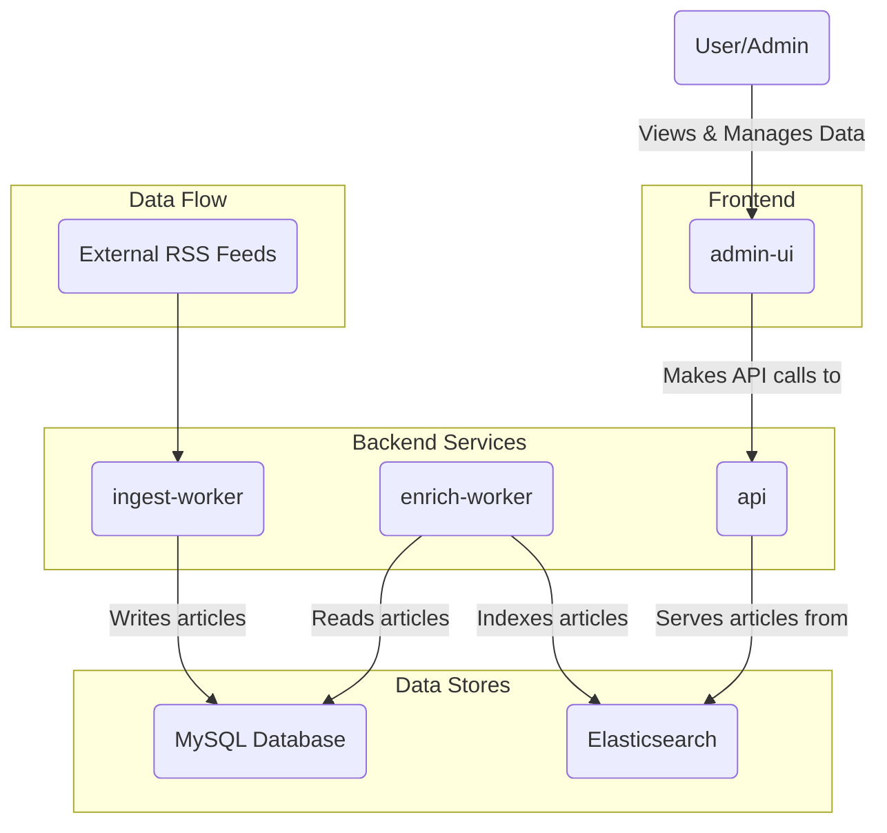

# OpenBias

OpenBias is a full-stack application designed to ingest news articles from various sources, analyze them for potential bias, and present them through a clean, searchable interface. It's built as a monorepo with a set of distinct, container-ready services that work together to deliver a seamless experience.

## Architecture

The system is composed of several microservices and data stores that handle different aspects of the data pipeline, from ingestion to presentation.



- **`ingest-worker`**: Fetches articles from predefined RSS feeds and stores them in a MySQL database.
- **`enrich-worker`**: Takes new articles from the database and indexes them into Elasticsearch for powerful searching and aggregation.
- **`api`**: A Hono-based API server that provides an interface to query the articles stored in Elasticsearch.
- **`admin-ui`**: A React-based single-page application for administrators to view and manage the articles.
- **Data Stores**:
    - **MySQL**: The primary database for storing source information and raw article data.
    - **Elasticsearch**: Used for indexing articles to provide fast and complex search capabilities.

## Packages

The monorepo is organized into the following packages:

-   `packages/admin-ui`: The frontend dashboard built with React, Vite, TypeScript, Tailwind CSS, and TanStack Router.
-   `packages/api`: The main backend API that serves data to the UI.
-   `packages/db`: Contains the Drizzle ORM schema, database connection logic, and seeding scripts for the MySQL database.
-   `packages/ingest-worker`: A standalone service responsible for polling RSS feeds and ingesting new articles.
-   `packages/enrich-worker`: A standalone service that processes articles from the database and pushes them to Elasticsearch.
-   `packages/common`: A shared library for common code and types used across the different packages.

## Prerequisites

-   [Bun](https://bun.sh/)
-   [Docker](https://www.docker.com/) and [Docker Compose](https://docs.docker.com/compose/)

## Getting Started

Follow these steps to get the OpenBias application up and running on your local machine.

### 1. Clone the Repository

```bash
git clone https://www.github.com/yuvibirdi/open-bias
cd open-bias
```

### 2. Install Dependencies

This project uses Bun for package management. Install all dependencies from the root of the project.

```bash
bun install
```

### 3. Configure Environment Variables

Create a `.env` file in the root of the project by copying the example file.

```bash
cp .env.example .env
```

The default values in `.env.example` are configured to work with the provided Docker Compose setup.

### 4. Start Dependent Services

The project requires MySQL and Elasticsearch. A `docker-compose.yml` file is provided to easily spin up these services.

```bash
docker-compose up -d
```

This command will start both containers in the background.

### 5. Run Database Migrations and Seeding

With the database container running, you can apply the schema and seed the database with initial sources.

```bash
# Apply the database schema
bun --filter @open-bias/db run migrate

# Seed the database with initial sources
bun --filter @open-bias/db run seed
```

## Running the Application

You can run each service individually in separate terminal windows. This is useful for development as it provides isolated logs and hot-reloading.

```bash
# Run everything at once
bun --filter '*' run dev

# Run the API server
bun --filter @open-bias/api run dev

# Run the Admin UI
bun --filter @open-bias/admin-ui run dev

# Run the Ingest Worker to fetch articles
bun --filter @open-bias/ingest-worker run dev

# Run the Enrich Worker to index articles in Elasticsearch
bun --filter @open-bias/enrich-worker run dev
```

After running these commands, the application will be available at `http://localhost:5173` (the default Vite port for the `admin-ui`).

## Available Scripts

Here are some of the main scripts you can run from the project root:

-   `bun install`: Installs dependencies for all packages.
-   `bun --filter <package-name> run dev`: Starts a specific package in development mode with hot-reloading.
-   `bun --filter <package-name> run build`: Builds a specific package for production.
-   `bun --filter @open-bias/db run migrate`: Applies the latest database schema changes.
-   `bun --filter @open-bias/db run seed`: Seeds the database with the initial set of news sources.
-   `bun --filter '*' run dev/build`: Starts all the dev/build scripts for all the packages.


# NOTE:
- It is possible sometimes that the `@open-bias/[package-name]` structuring doesn't not work. I am actively investigating this issue. The current fix is to instead use, `./packages/[package-name]`.
- Therefore, `bun --filter @open-bias/admin-ui run dev` turns to `bun --filter ./packages/admin-ui run dev`