# OpenBias

OpenBias is a comprehensive news bias analysis platform inspired by Ground News. It intelligently aggregates articles from 40+ diverse news sources, performs AI-powered bias analysis, and presents multi-perspective coverage through a modern web interface. The system helps users discover news blindspots and understand media coverage patterns across the political spectrum.

## ✨ Key Features

- **🤖 AI-Powered Bias Analysis**: OpenAI integration for automated bias detection and sentiment analysis
- **📊 Multi-Perspective Coverage**: Track left/center/right source distribution with visual bias indicators
- **🎯 Blindspot Detection**: Automated alerts for missing political perspectives in your news consumption
- **🔍 Advanced Story Grouping**: Multi-algorithm similarity matching using TF-IDF, Levenshtein distance, and semantic analysis
- **📰 40+ News Sources**: Continuous ingestion from diverse outlets across the political spectrum
- **👤 User Authentication**: Personalized experiences with JWT-based security
- **📱 Modern UI**: Responsive Vue.js interface with real-time updates and CoreUI components
- **⚡ Real-time Processing**: Optimized pipeline with configurable development limits

## 🏗️ Architecture

OpenBias follows a microservices architecture with separate workers for ingestion, analysis, and presentation:

```mermaid
graph TD
    subgraph "External Sources"
        RSS[40+ RSS Feeds<br/>Left/Center/Right Sources]
    end

    subgraph "Backend Services"
        IW[ingest-worker<br/>RSS Monitoring & Story Grouping]
        EW[enrich-worker<br/>AI Bias Analysis & Indexing]
        API[api<br/>REST Endpoints & Auth]
    end

    subgraph "Data Layer"
        MySQL[(MySQL<br/>Articles & Stories)]
        ES[(Elasticsearch<br/>Search & Analytics)]
    end

    subgraph "Frontend"
        UI[admin-ui<br/>Vue.js Dashboard]
    end

    RSS --> IW
    IW --> MySQL
    EW --> MySQL
    EW --> ES
    API --> MySQL
    API --> ES
    UI --> API

    User[👤 Users] --> UI
```



### Core Components

- **`ingest-worker`**: Monitors 40+ RSS feeds, performs intelligent story grouping with quality controls, and maintains source diversity
- **`enrich-worker`**: AI-powered bias analysis using OpenAI, sentiment detection, and Elasticsearch indexing
- **`api`**: Hono-based REST API with JWT authentication, story endpoints, and user management
- **`admin-ui`**: Vue 3 dashboard with real-time story feed, bias visualization, and user authentication
- **Data Stores**: MySQL for persistent storage, Elasticsearch for advanced search and analytics

## 📦 Packages

The monorepo contains these interconnected packages:

-   **`packages/admin-ui`**: Vue 3 + TypeScript dashboard with CoreUI components, authentication, and real-time story feeds
-   **`packages/api`**: Hono-based REST API with JWT auth, story endpoints, and bias analysis triggers
-   **`packages/db`**: Drizzle ORM schema with enhanced tables for users, stories, coverage tracking, and AI analysis
-   **`packages/ingest-worker`**: Intelligent RSS monitoring with advanced story grouping and source diversity controls
-   **`packages/enrich-worker`**: AI bias analysis pipeline with OpenAI integration and Elasticsearch indexing
-   **`packages/common`**: Shared TypeScript types and utilities across all packages

## 🚀 Quick Start

### Prerequisites
-   [Bun](https://bun.sh/) - Fast JavaScript runtime and package manager
-   [Docker](https://www.docker.com/) and [Docker Compose](https://docs.docker.com/compose/) - For MySQL and Elasticsearch

### 1. Setup

```bash
# Clone repository
git clone https://github.com/yuvibirdi/open-bias
cd open-bias

# Install dependencies
bun install

# Start infrastructure services
docker-compose up -d

# Configure environment (copy .env.example to .env if needed)
cp .env.example .env
```

### 2. Initialize Database

```bash
# Apply schema and seed with 40+ news sources
bun --filter @open-bias/db run migrate
bun --filter @open-bias/db run seed
```

### 3. Development Workflow

```bash
# Run all services (recommended for development)
bun --filter '*' run dev

# Or run individual services:
bun --filter @open-bias/api run dev          # Backend API
bun --filter @open-bias/admin-ui run dev     # Frontend UI
bun --filter @open-bias/ingest-worker run dev # RSS ingestion
bun --filter @open-bias/enrich-worker run dev # AI analysis
```

The application will be available at `http://localhost:5173`

### 4. Development Configuration

For faster development without GPU compute, edit processing limits in **one file**:

```typescript
// packages/enrich-worker/src/index.ts
const DEV_ARTICLE_LIMIT: number = 20;     // Articles to process (20 = quick testing)
const DEV_GROUP_ANALYSIS_LIMIT: number = 5; // Groups to analyze (5 = quick testing)
```

**💡 Tip**: Use `-1` for both values in production to process all content.

## 🧠 AI-Powered Bias Analysis

OpenBias uses advanced algorithms to detect bias patterns and ensure comprehensive coverage:

### Story Grouping Algorithm
- **Multi-technique Similarity**: TF-IDF, Levenshtein distance, and word overlap analysis
- **Strict Quality Controls**: 0.7 combined similarity threshold, source diversity enforcement
- **Time-bound Grouping**: 24-hour window for article clustering
- **Size Limits**: Maximum 15 articles per group to prevent mega-groups

### Bias Detection Features
- **OpenAI Integration**: GPT-powered bias analysis with structured output
- **Coverage Tracking**: Left/center/right source distribution monitoring
- **Blindspot Detection**: Automated alerts for missing perspectives
- **Sentiment Analysis**: Emotional tone and sensationalism scoring

### Configuration Options
```typescript
// Key thresholds (packages/enrich-worker/src/*)
TF_IDF_THRESHOLD: 0.65           // TF-IDF similarity requirement  
TITLE_SIMILARITY_THRESHOLD: 0.75 // Title matching requirement
COMBINED_THRESHOLD: 0.7          // Overall similarity requirement
MAX_GROUP_SIZE: 15               // Maximum articles per group
```

## 📰 News Sources (40+ Outlets)

OpenBias monitors a carefully curated selection of news sources across the political spectrum:

### Source Distribution
- **Center/Neutral (16)**: Associated Press, Reuters, BBC, Wall Street Journal, USA Today, CBS, ABC, NBC, Financial Times, Bloomberg, Christian Science Monitor, Al Jazeera, Times (UK), Deutsche Welle, France 24
- **Left-leaning (14)**: New York Times, Washington Post, CNN, NPR, The Guardian, The Atlantic, New Yorker, Huffington Post, MSNBC, Vox, Mother Jones, The Nation, Slate, The Independent  
- **Right-leaning (13)**: Fox News, New York Post, Washington Examiner, The Federalist, National Review, The American Conservative, Breitbart, Washington Times, Daily Wire, Telegraph

### Quality Controls
- **Automated bias classification** with validation
- **Feed availability monitoring** and health checks
- **Content quality filtering** and duplicate detection
- **Source diversity enforcement** in story grouping

## 🛠️ Management Commands

```bash
# Enhanced ingestion management
cd packages/ingest-worker
bun ingest-manager.ts status    # System health check
bun ingest-manager.ts ingest    # Manual ingestion cycle  
bun ingest-manager.ts schedule  # Automated ingestion (60min intervals)
bun ingest-manager.ts cleanup   # Clean unhealthy groups

# Development utilities
bun --filter @open-bias/db run migrate  # Apply schema changes
bun --filter @open-bias/db run seed     # Seed news sources
bun --filter '*' run build              # Build all packages
```

## 🚦 Current Status & Roadmap

### ✅ Completed Features
- Multi-source story aggregation with quality controls
- AI-powered bias analysis and sentiment detection  
- Real-time coverage tracking and blindspot detection
- User authentication with JWT security
- Modern responsive Vue.js interface
- Advanced search and filtering capabilities
- Optimized pipeline with configurable development limits

### 🔮 Future Enhancements
- Real-time WebSocket updates for live story feeds
- Enhanced ML models beyond OpenAI for bias detection
- Social features: user comments and discussions
- Email notifications for critical blindspots
- Mobile app development
- Advanced analytics dashboard
- International news source expansion

## 🤝 Contributing

OpenBias is open source and welcomes contributions! The codebase uses TypeScript throughout with comprehensive type safety, modern tooling, and a clean monorepo structure.

## 📄 License

MIT License - see LICENSE file for details.

---

**🎯 OpenBias**: Your open-source alternative to Ground News for comprehensive news bias analysis and multi-perspective coverage tracking.